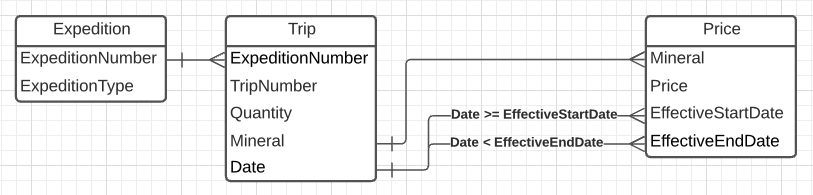

# Data Engineering Take Home

## Mission 1 - Data Aggregation

The objective of this mission is to create a program that generates a summary of an input file.
I expanded the scope of this mission to demonstrate how this program might be built using
technologies that could be used to build the data platform components:
* Pure functional programming.
* Reactive stream processing of data.
* Using category theory to improve understanding of the code.

The program is a ZIO `ZStream` program. See `Mission1.scala` for the code. At the high level,
this program:
* Reads the CSV file as a stream of bytes, which is transformed into a stream of strings where each string represents a CSV row.
* Decode the CSV row into a `MineralSummary`.
* Decode failures are logged and filtered out.
* The stream of `MineralSummary` is summarized by folding over the stream using a `Monoid`.
* The single aggregated `MineralSummary` is formatted as CSV text and written to the file.

### Running

The project is an SBT project, and these instructions assumes that the reader has SBT installed.

To run the project (the main class has been configured to be `andy42.de.Mission1`):
```sbt
sbt run
```

The input file is read from the path `data/expeditions.csv`, and the aggregated output is
written to `data/minerals.csv`.

To run the unit tests:
```sbt
sbt test
```

You will notice that the different unit tests are implemented using a different style:
* `MineralSummary` - test pure Scala code.
* `MineralSummaryMonoidLaws` - test that aggregation monoid observes monoid _laws_.
* `RowDecoderSpec` - Test the effectful decoding using ZIO Test framework.

### Decoding

The decoding of CSV rows is done in a ZIO module (the `RowDecoder` layer).
What is interesting about this is that the decoding transforms all the failures into
instances of a sealed trait `DecodeFailure`. This allows handling the errors to be done in
a uniform way. In this case, the handling is simple (the failures are logged as JSON).

The implementation of the code that logs and filters out the decode failures is shown
inline in the main program. In practice, this is not an optimal implementation and could
have a more optimal implementation in a _transducer_.


### Aggregating

A `MineralSummary` is just a type alias for a`Map[Mineral, Quantity]`.

The aggregation of `MineralSummary` instances into a single total is done using a 
`Monoid[MineralSummary]`. A _Monoid_ is typically used to implement aggregations, and
particularly big data aggregations. Imagine that this code could be expanded to aggregate
multiple files in parallel.

While the implementation of the Monoid is very simple, reasoning about the implementation's
correctness can be difficult. In this case, a unit test is included in `MineralSummaryMonoidLaws`
that checks the implementation's correctness against the category theory that applies to
monoids.

## Mission 2 - Entity Relationship Diagram

In this mission, the schema from `expeditions.csv` is transformed into an
Entity Relationship Diagram.
The columns in the CSV are used as the starting point, and it is broken out into
a more normalized form consisting of three tables representing:
* Expedition
* Trip
* Price

In particular, the Price table is represented as a _slowly changing dimension_ using SCD2.

* The fields are broken out into three entities: Expedition, Trip, Number.
* The `ExpeditionNumber` column appears in both `Expedition` and `Trip` to relate the two entities.
* A `Date` column is added to `Trip` to describe the point in time when the trip was made.
* `Price` is represented using SCD2, and relates `Trip` to the price that was in effect on the date of the trip.

